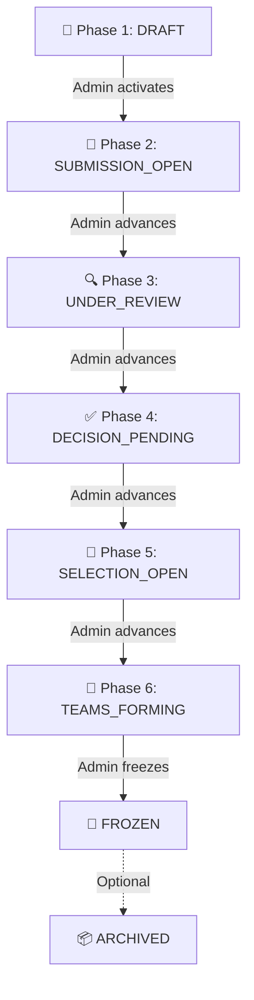
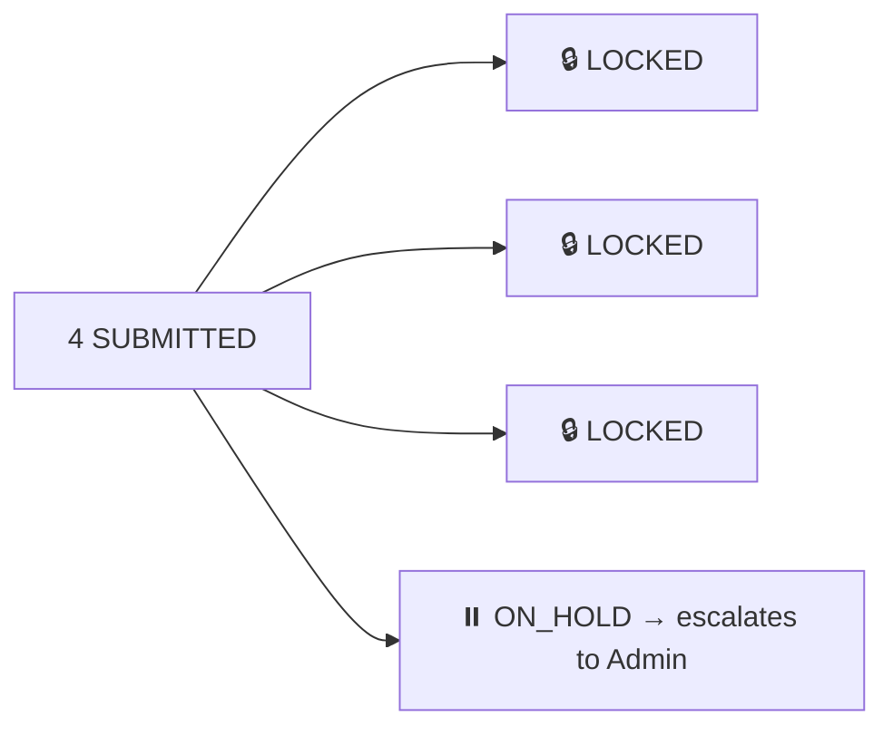
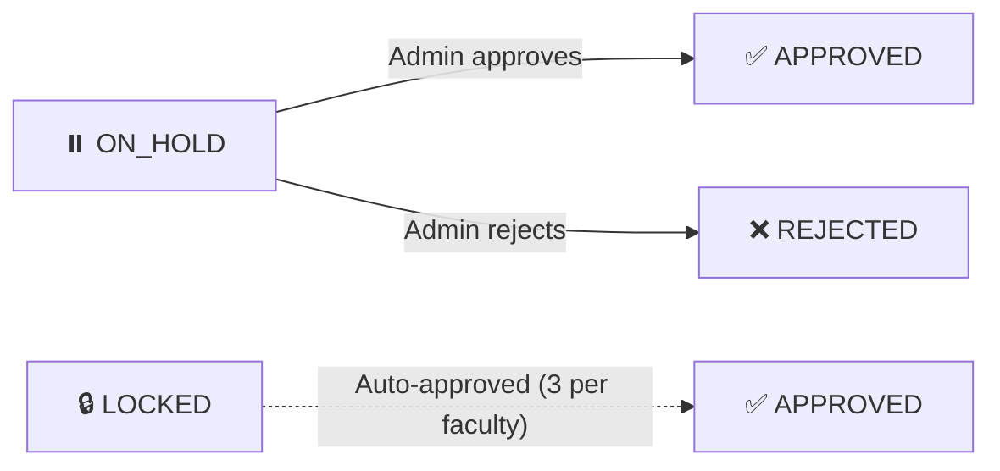
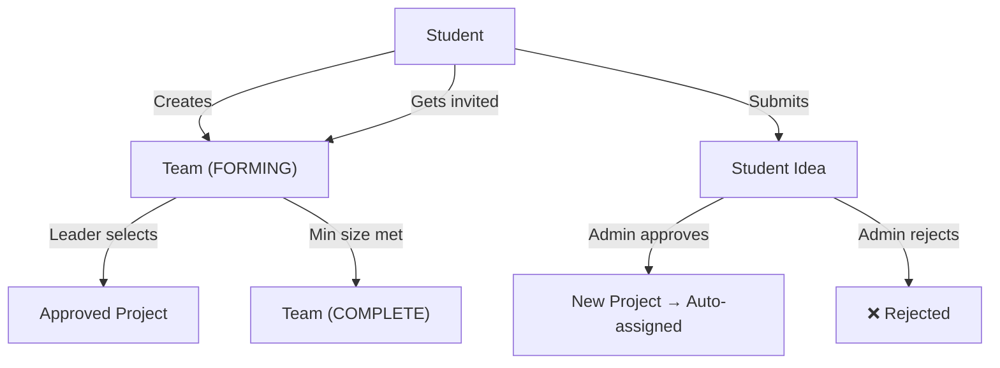
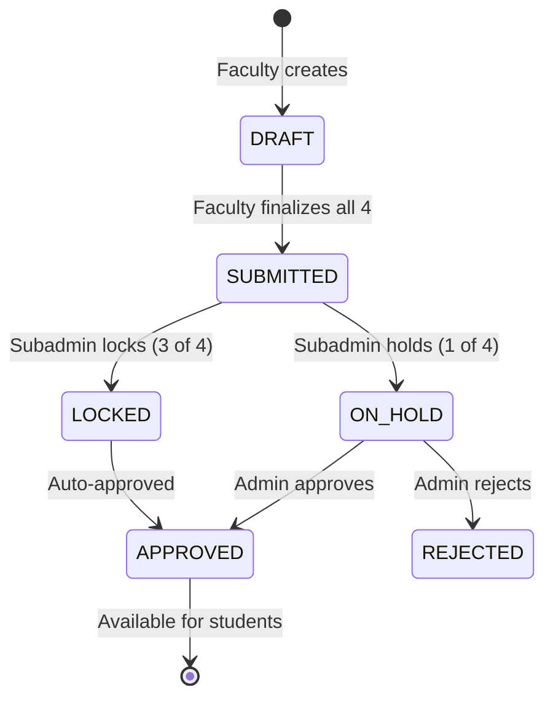
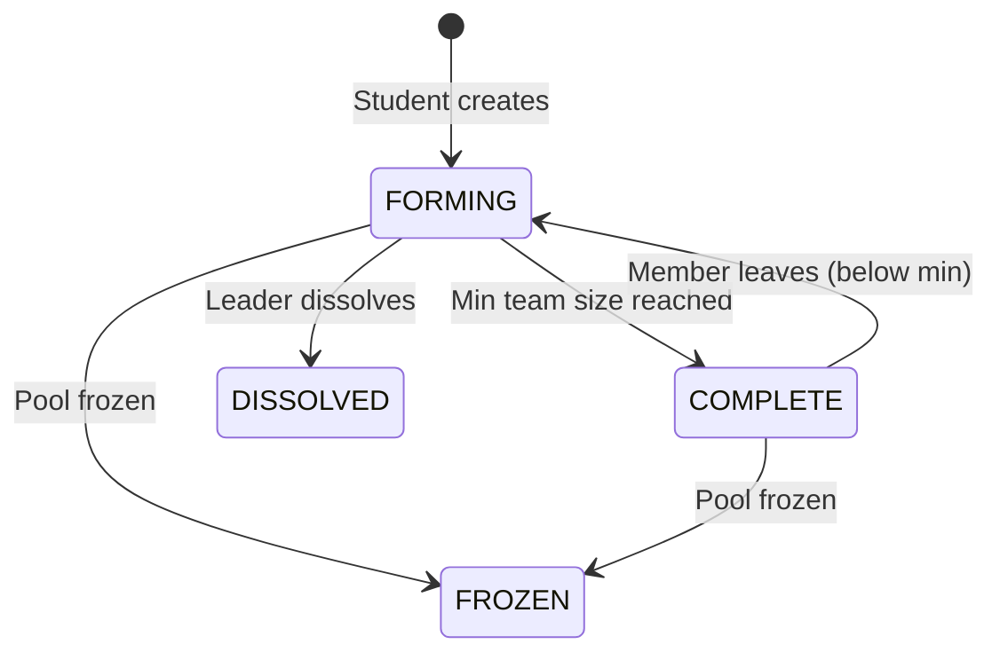

# Project Allocation Platform — Complete Flow

## 🎯 Platform Overview

A university project allocation system with **4 user roles** and a **6-phase lifecycle** that takes a pool from creation to final team freeze.

---

## 👥 The 4 Roles

| Role | Purpose |
|---|---|
| **Admin** | Creates pools, manages users, sets timelines, makes final approve/reject decisions |
| **Subadmin** | Reviews faculty proposals — locks 3, holds 1 for admin review |
| **Faculty** | Submits exactly 4 project proposals per pool |
| **Student** | Browses projects, forms teams, selects projects, submits ideas |

---

## 🔄 The 6-Phase Lifecycle



---

## 📋 Detailed Phase-by-Phase Flow

### Phase 1: `DRAFT` — Pool Creation
**Actor:** Admin

```
Admin logs in → Dashboard → Create New Pool
  ├── Sets pool name, academic year, semester, department
  ├── Configures 8 timeline dates:
  │     • Submission Start/End
  │     • Review Start/End
  │     • Decision Deadline
  │     • Selection Start/End
  │     • Team Freeze Date
  ├── Sets min/max team size
  ├── Toggles "Allow Student Ideas"
  └── Assigns users to pool:
        • Subadmins (≥1 required)
        • Faculty (≥1 required)
        • Students (≥1 required)
```

> [!NOTE]
> Pool can only be edited while in `DRAFT` status. Once activated, timeline and user assignments are locked.

**Transition:** Admin clicks **"Activate Pool"** → Status becomes `SUBMISSION_OPEN`
**Notification:** All assigned faculty receive "Submissions Open" notification.

---

### Phase 2: `SUBMISSION_OPEN` — Faculty Proposals
**Actor:** Faculty

```
Faculty logs in → Dashboard → "My Proposals"
  ├── Creates up to 4 project proposals (saved as DRAFT)
  │     Each proposal has:
  │     • Title
  │     • Description
  │     • Domain (optional)
  │     • Prerequisites (optional)
  │     • Expected Outcome (optional)
  │     • Max Team Size
  ├── Can edit/delete DRAFT proposals freely
  └── Once exactly 4 exist → clicks "Finalize All"
        • All 4 proposals change: DRAFT → SUBMITTED
        • Faculty marked as hasSubmitted = true
        • Cannot edit/add/delete after this
```

> [!IMPORTANT]
> Faculty MUST submit exactly 4 proposals. No more, no less. This is enforced at the database level.

**Transition:** Admin advances phase → Status becomes `UNDER_REVIEW`
**Notification:** All assigned subadmins receive "Review Phase Started" notification.

---

### Phase 3: `UNDER_REVIEW` — Subadmin Review
**Actor:** Subadmin

```
Subadmin logs in → Review Console → Select Pool → Select Faculty
  ├── Views all 4 SUBMITTED proposals from a faculty
  └── Must make decisions on ALL 4 at once:
        • LOCK 3 proposals  (these are strong — go to approved pipeline)
        • HOLD 1 proposal   (this one escalates to admin for final call)
```



> [!TIP]
> The 3:1 ratio (Lock 3, Hold 1) is enforced by the system. Subadmin cannot deviate from this rule.

**Notification:** Faculty receives "Proposals Reviewed — 3 locked, 1 on hold" notification.

**Transition:** Admin advances phase → Status becomes `DECISION_PENDING`

---

### Phase 4: `DECISION_PENDING` — Admin Final Decision
**Actor:** Admin

```
Admin logs in → Dashboard → Pool Detail → ON_HOLD Projects
  ├── Views each ON_HOLD project (the "held" ones from subadmin)
  └── For each ON_HOLD project:
        • ✅ APPROVE → Status becomes APPROVED (available for students)
        • ❌ REJECT → Status becomes REJECTED (removed from pool)
        • Can add admin notes with decision
```



> [!NOTE]
> LOCKED projects from the subadmin are effectively approved and available. The ON_HOLD ones need explicit admin decision.

**Notification:** Faculty gets "Project Approved" or "Project Rejected" notification per project.

**Transition:** Admin advances phase → Status becomes `SELECTION_OPEN`
**Notification:** All assigned students receive "Project Selection Open" notification.

---

### Phase 5: `SELECTION_OPEN` — Team Formation & Project Selection
**Actor:** Student

This is the most interactive phase. Students do 3 things:

#### 5a. Create or Join a Team
```
Student logs in → Student Hub → "Form Team"
  ├── Option A: Create a new team
  │     • Enter team name
  │     • Student becomes LEADER
  │     • Team status = FORMING
  │
  └── Option B: Accept an invite
        • Leader of another team sends invite
        • Student receives notification
        • Accept → joins as MEMBER
        • Decline → stays free
```

#### 5b. Browse & Select a Project
```
Student (Leader only) → Browse Projects
  ├── Views all APPROVED projects in their pool
  ├── Sees which ones are already taken
  └── Selects an available project for their team
        • Uses database transaction (prevents race conditions)
        • If two teams click simultaneously, only one succeeds
        • Other gets "Project was just taken" error
```

#### 5c. Submit a Student Idea (Optional)
```
Student → Submit Idea
  ├── Must be in a team (with no project yet)
  ├── Submits: title, description, domain
  └── Idea goes to Admin for review
        • Admin approves → auto-creates project + assigns to team
        • Admin rejects → student notified
```



> [!WARNING]
> **Race Condition Prevention:** The project selection uses a Prisma `$transaction` with a double-check pattern. Even if two teams click "Select" at the same millisecond, only one will succeed.

**Transition:** Admin advances phase → Status becomes `TEAMS_FORMING`

---

### Phase 6: `TEAMS_FORMING` — Final Adjustments
**Actor:** Student

```
Same capabilities as Phase 5 but signals the final window:
  • Students can still join/leave teams
  • Teams can still select projects
  • Leaders can transfer leadership
  • But the freeze is imminent
```

**Transition:** Admin clicks **"Freeze Pool"** → Status becomes `FROZEN`
- All teams get `isFrozen = true`, status = `FROZEN`
- No more changes allowed to any team
- Allocation is **final**

---

## 🔔 Notification System

Notifications are triggered automatically at every critical event:

| Event | Who Gets Notified | Channel |
|---|---|---|
| Pool activated | All faculty in pool | In-app |
| Review phase starts | All subadmins in pool | In-app |
| Proposals reviewed | Faculty whose proposals were reviewed | In-app |
| Project approved/rejected | Faculty who submitted it | In-app + Email |
| Selection phase opens | All students in pool | In-app |
| Team invite sent | Invitee student | In-app |
| Invite accepted/declined | Team leader | In-app |

---

## 📊 Complete Status Flow — Projects



## 🏗️ Complete Status Flow — Teams



---

## 🗺️ Page Map by Role

### Public (No Login)
| Page | Path |
|---|---|
| Home | `/` |
| About | `/about` |
| How It Works | `/how-it-works` |
| FAQ | `/faq` |
| Contact | `/contact` |
| Results | `/results` |
| Login | `/login` |

### Admin Dashboard
| Page | Path | Purpose |
|---|---|---|
| Dashboard | `/dashboard` | Stats, pool overview, phase controls |
| Users | `/users` | CRUD all users (admin, subadmin, faculty, student) |
| Pools | `/pools` | Create/edit/activate pools |
| Pool Detail | `/pools/:id` | Deep view of a pool — timeline, users, projects, teams |
| Student Ideas | `/student-ideas` | Approve/reject student-submitted ideas |
| Reports | `/reports` | Pool analytics, CSV export |
| Audit Logs | `/audit` | Full audit trail of all system actions |

### Subadmin Dashboard
| Page | Path | Purpose |
|---|---|---|
| Review Console | `/dashboard` | Stats + faculty submission list |
| Review | `/review` | Lock 3 / Hold 1 decision interface |
| Pools | `/pools` | View assigned pools |
| Reports | `/reports` | Pool statistics |

### Faculty Dashboard
| Page | Path | Purpose |
|---|---|---|
| Dashboard | `/dashboard` | Create/manage proposals |
| Proposals | `/proposals` | Same as dashboard (proposal CRUD) |

### Student Dashboard
| Page | Path | Purpose |
|---|---|---|
| Dashboard | `/dashboard` | Quick actions + team info |
| Browse Projects | `/projects` | View approved projects, select for team |
| My Team | `/my-team` | Team management, invites, membership |
| Ideas | `/ideas` | Submit student project ideas |

---

## 🔐 Access Control Summary

| Action | Admin | Subadmin | Faculty | Student |
|---|:---:|:---:|:---:|:---:|
| Create pool | ✅ | ❌ | ❌ | ❌ |
| Activate/advance pool | ✅ | ❌ | ❌ | ❌ |
| Manage users | ✅ | ❌ | ❌ | ❌ |
| Submit proposals | ❌ | ❌ | ✅ | ❌ |
| Review proposals (3:1) | ❌ | ✅ | ❌ | ❌ |
| Approve/reject held | ✅ | ❌ | ❌ | ❌ |
| Create team | ❌ | ❌ | ❌ | ✅ |
| Select project | ❌ | ❌ | ❌ | ✅ (leader) |
| Submit idea | ❌ | ❌ | ❌ | ✅ |
| Approve idea | ✅ | ❌ | ❌ | ❌ |
| Freeze pool | ✅ | ❌ | ❌ | ❌ |
| View reports | ✅ | ✅ | ❌ | ❌ |
| View audit logs | ✅ | ❌ | ❌ | ❌ |

---

## ⚡ Key Technical Safeguards

1. **Race Condition Prevention** — Project selection uses `$transaction` with double-check locking
2. **Phase Enforcement** — Actions are blocked if the pool isn't in the correct status
3. **Role-Based Access** — Every API route checks `user.role` via middleware
4. **Proposal Count Lock** — Faculty can't exceed 4 proposals; subadmin must review exactly 4
5. **3:1 Ratio Enforcement** — Subadmin must lock exactly 3 and hold exactly 1
6. **Team Freeze** — Once frozen, no team modifications are possible
7. **Audit Trail** — Every significant action is logged with actor, action, entity, and timestamps
